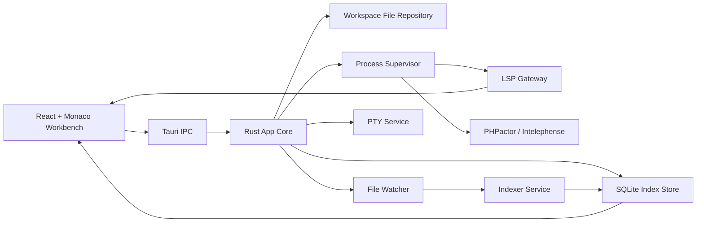

# Fleet-like Editor Project Plan

Date: 2026-06-15
Status: Active plan

## Vision

Build a lightweight desktop code editor that starts fast in Basic mode and can opt into IDE-like project intelligence when the user enables Smart mode.

The target is not PhpStorm parity in the first release. The target is a Fleet-like workbench with a clean architecture, a pleasant Basic editor loop, and a PHP-focused smart layer that can grow over time.

## Product Modes

| Mode | Behavior |
| --- | --- |
| Basic | Open folder, browse files, edit, save, search, command palette, terminal later. No LSP or project index. |
| Light Smart | Starts language server features for opened files: diagnostics, hover, completion, definitions. No full custom index. |
| Full Smart | Starts language server, file watcher, project indexer, SQLite symbol store, PHP tree, workspace symbols, and index health UI. |

## Initial Decisions

| Area | Decision | Reason |
| --- | --- | --- |
| Desktop shell | Tauri v2 | Small footprint, Rust host services, strong IPC boundaries. |
| Editor core | Monaco | Mature IDE-like editing behavior and LSP ecosystem. |
| Frontend | React + TypeScript + Vite | Productive, common, works well with Monaco. |
| Backend | Rust | Strong fit for filesystem, processes, watchers, SQLite, PTY, and indexing. |
| PHP LSP default | PHPactor | Open-source, Composer-aware, safer to bundle or automate. |
| PHP LSP optional | Intelephense | Strong UX, but proprietary/freemium; use bring-your-own binary/licence. |
| Project index | SQLite-backed structural index | Needed for fast PHP tree/search/cache UX. |
| PHP parser | tree-sitter PHP first | Fast tolerant parser for symbols and outlines. |
| File watching | Watchman preferred, Rust `notify` fallback | Robust large-repo handling with self-contained fallback. |
| Ignore handling | Rust `ignore` crate | Consistent `.gitignore` semantics. |

## Architecture

## Module Boundaries

- Workbench UI: layout, activity bar, sidebar, tabs, panels, status bar.
- Command Registry: command ids, titles, shortcuts, enabled state, execution.
- Workspace Gateway: frontend abstraction over host filesystem commands.
- Workspace Repository: Rust filesystem implementation.
- Editor Session: open documents, active file, dirty state, save/close flows.
- Language Module: LSP providers, capability registry, document sync, diagnostics.
- Index Module: watcher, ignore matcher, parser registry, job queues, SQLite store.
- Settings Module: app/workspace settings, recent workspaces, future provider config.
- Terminal Module: xterm.js frontend and Rust PTY backend.

## PHP Strategy

Use LSP for semantic behavior:

- completion
- hover
- go to definition
- references
- rename where supported
- diagnostics
- formatting/code actions where supported

Use the custom index for product/workspace behavior:

- PHP namespace/class/member tree
- project symbol search
- Composer package/root awareness
- index progress and health
- cached structural search
- fallback outline data

Do not build custom PHP type inference, reference resolution, or diagnostics in MVP. Those are language-server responsibilities until the editor has enough usage data to justify deeper semantic work.

## Composer And Trust

- Parse `composer.json`, `composer.lock`, and `vendor/composer` metadata as data.
- Do not execute Composer autoloaders or project PHP files in untrusted workspaces.
- Prefer classmap-only behavior where possible.
- Watch Composer metadata for soft reindex triggers.
- Do not full-scan `vendor` by default.

## Indexer Design

The indexer should be an `IndexService` with adapters:

- `FileWatcher`
- `IgnoreMatcher`
- `ParserRegistry`
- `IndexStore`
- `JobScheduler`
- `IndexEventPublisher`

Queues:

- `watch-events`
- `metadata-scan`
- `parse`
- `db-write`
- `maintenance`

Rules:

- Watcher events are hints, not truth.
- Store `index_generation` per workspace.
- Jobs must check cancellation before read, parse, commit, and event publish.
- Use one SQLite writer queue and multiple read connections.
- Enable WAL, `synchronous=NORMAL`, `busy_timeout`, and periodic `PRAGMA optimize`.

Reindex modes:

- Soft: rescan metadata and reindex changed/missing files.
- Language: reparse one language after parser/query upgrade.
- Hard: drop workspace index rows and rebuild.

## SQLite Schema Direction

Core tables:

- `workspaces`
- `indexed_files`
- `symbols`
- `references`
- `composer_packages`
- `index_runs`

Later:

- `inheritance_edges`
- `diagnostic_snapshots`
- `file_text_fts`
- `framework_routes`

## MVP Scope

MVP proves the product loop:

- desktop app starts
- open folder
- browse lazy file tree
- edit/save files in Monaco
- tabs and dirty state
- command palette
- basic file operations
- Basic/Smart mode state
- PHPactor Light Smart prototype
- diagnostics and go-to-definition
- initial PHP structural index
- project symbol search
- PHP tree panel

## V1 Scope

- stable terminal
- settings UI
- provider config
- find references
- workspace symbols
- Composer-aware PHP detection
- index rebuild commands
- index health/errors panel
- keyboard shortcut editor
- basic Git decorations
- session restore
- installable macOS build

## Testing Strategy

- Frontend unit tests for commands, path helpers, editor session logic.
- Component/browser tests for file tree, tabs, command palette, and status UI.
- Rust unit tests for path handling and filesystem repository behavior.
- Rust integration tests for index queue and SQLite store with temp workspaces.
- PHP fixtures for Composer, incomplete PHP, Laravel-like, Symfony-like, WordPress-like projects.
- Mock only true external boundaries; use real internal collaborators and temp/in-memory infrastructure.

## Architecture Quality Gate

After each implementation slice:

- Review SOLID principles.
- Confirm Command, Strategy, Adapter, Repository, Observer, and Pipeline patterns are used only where they genuinely reduce complexity.
- Confirm UI depends on abstractions rather than raw Tauri/process/index implementations.
- Confirm functions/classes stay focused.
- Run relevant tests and `coderabbit review --agent --base main`.

## Known Risks

- PHP intelligence quality may disappoint if provider capabilities are uneven.
- Tauri/Monaco LSP bridge may require a Node sidecar prototype.
- Large project indexing can hurt responsiveness without careful queueing and cancellation.
- Sidecar packaging can become complicated.
- Scope can drift toward a full IDE clone.

## Source Notes

- Tauri v2: https://v2.tauri.app/
- Monaco Editor: https://microsoft.github.io/monaco-editor/
- LSP: https://microsoft.github.io/language-server-protocol/
- PHPactor: https://phpactor.readthedocs.io/
- Intelephense: https://intelephense.com/docs
- Tree-sitter PHP: https://github.com/tree-sitter/tree-sitter-php
- Watchman: https://facebook.github.io/watchman/
- SQLite WAL: https://sqlite.org/wal.html
