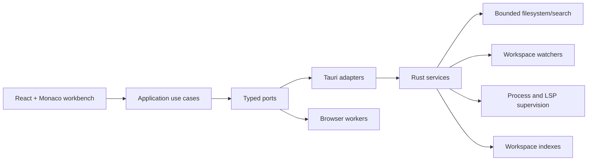

# Codevo Editor Project Plan

Date: 2026-07-28

Status: Active product plan

## Active Vision

Build a native, keyboard-first desktop IDE that feels immediate for everyday
JavaScript, TypeScript, Node.js, and Express work. The editor should preserve the
workflows developers expect from VS Code's editor core while using strict workspace
ownership, bounded resource use, and native Rust services.

This is a practical workflow target, not a 1:1 VS Code claim. The extension ecosystem,
arbitrary DAP adapters, remote development, containers, and unsupported platforms are
separate product-sized areas.

PHP, Nette, Laravel, and related tools remain supported, but they are secondary to the
current JS/TS/Node/Express direction.

## Historical Context

The repository started as a Fleet-like, PHP-focused editor with Basic, Light Smart, and
Full Smart modes. That plan explains the existing PHPactor, Composer, SQLite index,
PHP-tree, Nette, and framework modules, but it is no longer the active prioritization
model. Do not use the old Fleet/PHP MVP sequence to choose new work.

## Product Priorities

1. Fast editing and navigation for large files, repositories, and monorepos.
2. Reliable JS/TS language intelligence with exact capability and session ownership.
3. Keyboard-first file, symbol, command, history, and editor switching.
4. Node and Express project awareness: packages, tasks, tests, Problems, routes, and
   launch configuration.
5. Truthful degradation under hard limits instead of freezes or silent partial data.
6. Preserve existing PHP/framework capabilities; targeted expansion requires explicit
   user reprioritization.

Debug Console expansion and broad debugger parity are not the current editor-core
priority unless a required daily Node workflow depends on them.

## Architecture

```mermaid
flowchart LR
    UI["React + Monaco workbench"] --> APP["Application use cases"]
    APP --> PORTS["Typed ports"]
    PORTS --> TAURI["Tauri adapters"]
    PORTS --> WORKERS["Browser workers"]
    TAURI --> RUST["Rust services"]
    RUST --> FS["Bounded filesystem/search"]
    RUST --> WATCH["Workspace watchers"]
    RUST --> PROC["Process and LSP supervision"]
    RUST --> INDEX["Workspace indexes"]
```

Dependencies point inward. React, Monaco, Tauri, workers, filesystem, processes, and
language servers remain adapters around application and domain policies.

## Completed Editor And Project Foundation

- Monaco editing, multi-group tabs, preview tabs, dirty tracking, save/close flows, and
  workspace-scoped session persistence.
- MRU switching per project and editor group, with bounded retained scope state.
- Navigation history that persists sufficient view state while closed transient Monaco
  models are disposed when they are neither open nor retained by navigation ownership.
- Quick Open file search with `>`, `@`, and `#` dispatch, exact seed handoff,
  `path:line[:column]`, backend truncation truth, and accessible syntax guidance.
- Docked text search with bounded Rust disk scanning and a latest-wins worker overlay
  for dirty buffers.
- Bounded workspace package graphs for npm/pnpm/yarn/bun-style monorepos, including
  package ownership used by scripts, tests, Express routes, and Problems attribution.
- JavaScript/TypeScript LSP requests with exact session authority, cancellation,
  latest-value document changes, and watcher-triggered project resynchronization.
- Background editor change-hunk computation with large-file degradation.
- Watcher overflow/retry behavior that requests an exact-session project resync or
  publishes a truthful rescan rather than replaying an unsafe partial event set.

## Current Performance Contract

- Typing, cursor movement, scrolling, and tab switching must not wait for filesystem
  crawls, full-workspace parsing, large diffs, or language-server process work.
- Expensive main-thread work moves to a browser worker or Rust blocking pool.
- Search, package graphs, models, decorations, events, and cached owners have explicit
  caps and deterministic cleanup.
- Requests are cancellable and latest-owner-wins; A→B→A workspace reuse is a new
  generation, not permission for old work to publish.
- Large-file reductions are visible and reversible when the exact document becomes
  eligible again.

## Search Semantics And Limits

Disk search is authoritative for the on-disk workspace. Dirty-buffer overlay search is
deliberately narrower:

- literal case-sensitive or case-insensitive matching is supported;
- regex and `wholeWord` dirty-buffer matching are unsupported because JavaScript
  `RegExp` does not share Rust's linear-time regex language or Unicode word-boundary
  semantics;
- non-empty file masks are unsupported for dirty overlays until they can share the
  native ignore/mask policy;
- unsupported dirty semantics produce an explicit limitation/truncated state rather
  than approximate rows.

The worker structured-clone boundary accepts at most 16 dirty documents, 4,096 dirty
paths, 256 Ki UTF-16 code units per document, 1 Mi aggregate code units, 768 KiB UTF-8
per document, 3 MiB aggregate UTF-8, 500 results, and a 2 MiB response. Requests time
out and superseded workers are terminated.

## Near-Term Plan

1. Finish integration and full-gate validation of the current editing/navigation wave.
2. Profile representative large files and monorepos, then fix measured latency and
   retention regressions without weakening ownership.
3. Close the highest-value JS/TS editor gaps in completion, navigation, refactoring,
   Problems, workspace/package awareness, and search UX.
4. Improve task/test/Express project workflows where they affect everyday Node work.
5. Reassess PHP/Nette work only when the user explicitly reprioritizes it; completing
   or stabilizing a JS/TS milestone never triggers that transition automatically.

## Explicit Non-Goals For The Current Phase

- Claiming 1:1 VS Code parity or assigning an unsupported completion percentage.
- Recreating VS Code's extension marketplace.
- Universal DAP, remote/container runtimes, or arbitrary executable launch recipes.
- Running unbounded regex, parsing, indexing, diffing, or workspace scans on the UI
  thread.
- Replacing established PHP capabilities merely to fit the new priority.

## Completion Evidence

A slice is complete only after focused tests, independent review, applicable full
frontend and Rust gates, formatting, hotspot ratchets, and `git diff --check` pass.
Documentation records implemented behavior and unsupported scope; final counts are
published only from the lead's integrated gate run.
